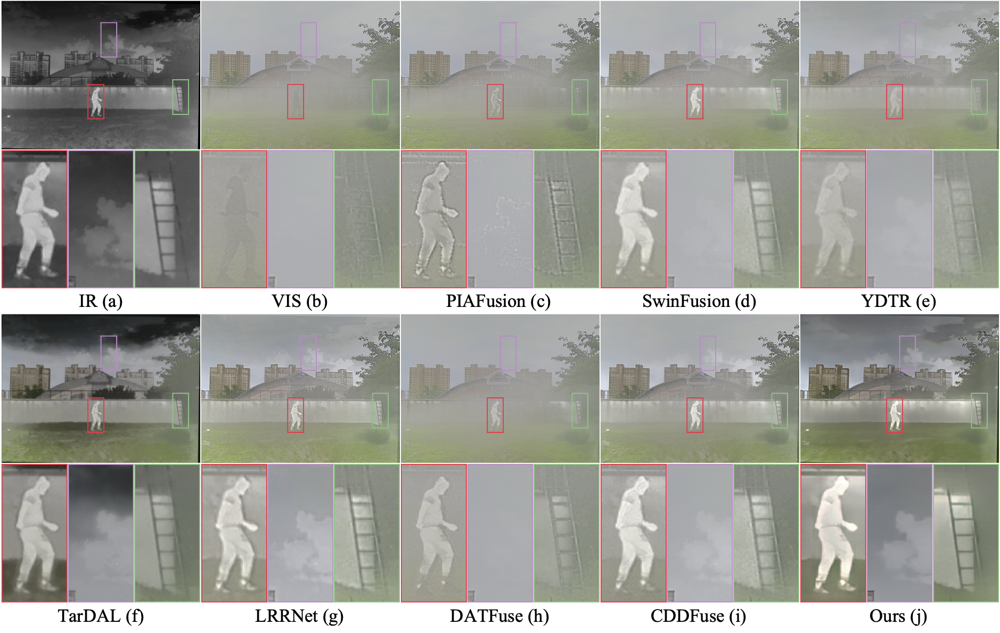

# TSDM-Fusion
The code of paper 'A Novel Teacher-student Framework with Degradation Model for Infrared-Visible Image Fusion'.
**The code and pre-trained models will be released after the paper is published.**

# Compare Results
## TNO
TNO: Visual comparison results on the TNO dataset. (a) and (b) are infrared and visible images, while (c)-(i) are the results of image fusion algorithms and (j) is the result of our method. Please zoom in on the images to see more details. 
## ROAD SCENE
ROAD SENCE: Visual comparison results on the Road Scene dataset. (a) and (b) are infrared and visible images, while (c)-(i) are the results of image fusion algorithms and (j) is the result of our method. Please zoom in on the images to see more details. 
## LLVIP
LLVIP: Visual comparison results on the LLVIP dataset. (a) and (b) are infrared and visible images, (c)-(i) are the results of image fusion algorithms, and (j) is the result of our method. Please zoom in on the images to see more details.  
## M3FD
M3FD: Visual comparison results on the M3FD dataset. (a) and (b) are infrared and visible images, (c)-(i) are the results of image fusion algorithms, and (j) is the result of our method. Please zoom in on the images to see more details. 
## YOLOV7
YOLOV7: Visual comparison of object detection results with YOLOv7 algorithm. (a) and (b) are infrared and visible images, (c)-(i) are the detection results of image fusion algorithms, and (j) is the result of our method. Please zoom in on the images to see more details. 
